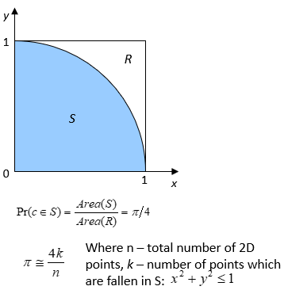

Get Started with the |onedpl_long|
##################################

|onedpl_short| works with the `Intel® oneAPI DPC++/C++ Compiler <https://software.intel.com/content/www/us/en/develop/documentation/get-started-with-dpcpp-compiler/top.html>`_
to provide high-productivity APIs to developers, which can minimize |dpcpp_long|
programming efforts across devices for high performance parallel applications.

|onedpl_short| consists of the following components:

* Parallel API
* API for DPC++ Kernels
* Macros

For general information about |onedpl_short|, visit the `oneDPL GitHub* repository <https://github.com/oneapi-src/oneDPL>`_,
or visit the `Intel® oneAPI DPC++ Library (oneDPL) Guide <https://software.intel.com/content/www/us/en/develop/documentation/oneapi-dpcpp-library-guide/top.html>`_
and the `Intel® oneAPI DPC++ Library main page <https://software.intel.com/content/www/us/en/develop/tools/oneapi/components/dpc-library.html>`_.

Before You Begin
================

Visit the |onedpl_long| `Release Notes
<https://software.intel.com/content/www/us/en/develop/articles/intel-oneapi-dpcpp-library-release-notes.html>`_
page for:

* Where to Find the Release
* Overview
* New in this Release
* Known Issues

Install the `Intel® oneAPI Base Toolkit (Base Kit) <https://software.intel.com/en-us/oneapi/base-kit>`_
to use |onedpl_short|.

To use Parallel API, include the corresponding header files in your source code.

All |onedpl_short| header files are in the ``oneapi/dpl`` directory. Use ``#include <oneapi/dpl/…>`` to include them.
|onedpl_short| uses the namespace ``oneapi::dpl`` for most its classes and functions.

To use tested C++ standard APIs, you need to include the corresponding C++ standard header files
and use the ``std`` namespace.

Usage Examples
==============

|onedpl_short| sample code is available from the
`oneAPI GitHub samples repository <https://github.com/oneapi-src/oneAPI-samples/tree/master/Libraries/oneDPL>`_.
Each sample includes a readme with build instructions.

oneapi/dpl/random Usage Example
-------------------------------

This example illustrates |onedpl_short| Random Number Generators (RNGs) usage.
The sample below shows you how to create an RNG engine object (the source of pseudo-randomness),
a distribution object (specifying the desired probability distribution), and how to generate
the random numbers themselves. Random number generation is performed in a vectorized manner
to improve the speed of your computations.

This example performs its computations on your default DPC++ device. You can set the
``SYCL_DEVICE_TYPE`` environment variable to CPU or GPU.

.. code:: cpp

    template<int VecSize>
    void random_fill(float* usmptr, std::size_t n) {

        auto zero = oneapi::dpl::counting_iterator<std::size_t>(0);

        std::for_each(oneapi::dpl::execution::dpcpp_default,
    zero, zero + n/VecSize,
          [usmptr](std::size_t i){

            auto offset = i * VecSize;

            oneapi::dpl::minstd_rand_vec<VecSize> engine(seed, offset);
            oneapi::dpl::uniform_real_distribution<sycl::vec<float, VecSize>> distr;

            auto res = distr(engine);
            res.store(i, sycl::global_ptr<float>(usmptr));

           });
    }

oneDPL RNG Pi Benchmark Usage Example
-------------------------------------

A Monte Carlo Pi Estimation uses a randomized method to estimate the value of π.
The basic idea is to generate random points within a square, and to check what
fraction of these random points lie in a quarter-circle inscribed within that square.
The expected value is the ratio of the areas of the quarter-circle and the square (π/4).
You can take the observed fraction of points in the quarter-circle as an estimate of π/4.

This example shows you how to create an RNG engine object (the source of pseudo-randomness),
a distribution object (specifying the desired probability distribution), generate the
random numbers themselves, and then perform a reduction to count quantity of points that
fit into the square *S*. Random number generation is performed in scalar manner to simplify your code.

.. code:: cpp

    float estimated_pi;
    {
        sycl::queue q(sycl::gpu_selector{});
        auto policy = oneapi::dpl::execution::make_device_policy(q);

        float sum = std::transform_reduce( policy,
                                          oneapi::dpl::counting_iterator<int>(0),
                                          oneapi::dpl::counting_iterator<int>(N),
                                          0.0f,
                                          std::plus<float>{},
                                          [=](int n){
                                              float local_sum = 0.0f;
                                              oneapi::dpl::minstd_rand engine(SEED, n * ITER * 2);
                                              oneapi::dpl::uniform_real_distribution<float> distr;
                                              for(int i = 0; i < ITER; ++i) {
                                                  float x = distr(engine);
                                                  float y = distr(engine);
                                                  if (x * x + y * y <= 1.0)
                                                      local_sum += 1.0;
                                              }
                                              return local_sum / (float)ITER;
                                          }
        );
        estimated_pi = 4.0f * (float)sum / N;
    }

Find More
=========

.. list-table::
   :widths: 50 50
   :header-rows: 1

   * - Resource Link
     - Description
   * - `Intel® oneAPI DPC++ Library (oneDPL) Guide <https://software.intel.com/content/www/us/en/develop/documentation/oneapi-dpcpp-library-guide/top.html>`_
     - Refer to |onedpl_short| Library Guide for  more in depth information.
   * - `System Requirements <https://software.intel.com/content/www/us/en/develop/articles/intel-oneapi-dpcpp-system-requirements.html>`_
     - Check system requirements before you install |onedpl_short|.
   * - `Intel® oneAPI DPC++ Library (oneDPL) Release Notes <https://software.intel.com/content/www/us/en/develop/articles/intel-oneapi-dpcpp-library-release-notes.html>`_
     - Refer to release notes to learn about new updates in the latest release.
   * - `oneDPL Samples <https://github.com/oneapi-src/oneAPI-samples/tree/master/Libraries/oneDPL>`_
     - Learn how to use |onedpl_short| with samples.
   * - `Layers for Yocto* Project <https://www.intel.com/content/www/us/en/develop/documentation/get-started-with-intel-oneapi-iot-linux/top/adding-oneapi-components-to-yocto-project-builds.html>`_
     - Add oneAPI components to a Yocto project build using the meta-intel layers.