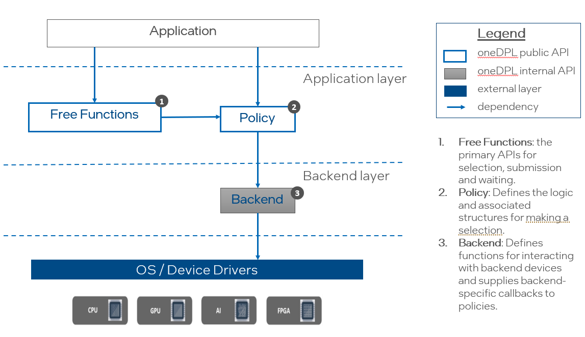
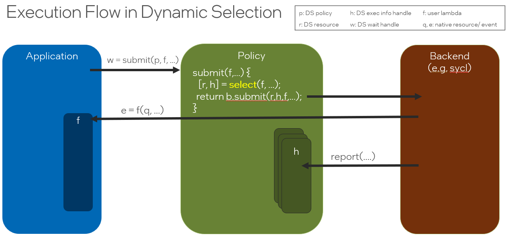

# Dynamic Device Selection API

## Introduction

Dynamic Selection is a Technology Preview feature 
[documented in the oneDPL Developer Guide](https://www.intel.com/content/www/us/en/docs/onedpl/developer-guide/2022-7/dynamic-selection-api.html).
Dynamic selection provides functions for choosing a resource using a *selection policy*. 
By default, the *resources* selected via Dynamic Selection APIs are SYCL queues. Since the
API itself is documented in the oneDPL Developer Guide that information will not
be repeated here excepted where necessary. It is assumed that readers of this document
are familiar with the API documentation.

This document contains the following:
- An overview of the current architecture and design.
- Exit criteria for moving from experimental to fully supported or, if these goals are not achieved in
a timely manner, for justifing removal the this feature.

## Overview of Architecture and Execution Flow

The key components of the Dynamic Selection API are shown below, including the *Free Functions*
(such as `submit`, `select`, `wait`, etc), a *Policy* object (such as `fixed_resource_policy`,
`round_robin_policy`, `dynamic_load_policy` and `auto_tune_policy`) and a *Backend* object
(currently only `sycl_backend`). Users interact with Dynamic Selection through the Free Functions
and their chosen Policy. The Free Functions have default implementations that depend on a limited set
of required functions in the Policy. Optional functions may be defined by a Policy to customize 
some of the Free Functions, such as `submit_and_wait` that would, by default, depend on multiple basis
functions. Resource specific instrumentation and types are definied in the *Backend*.



The following code example shows some of the key aspects of the API. The use of any empty
`single_task` is for syntactic demonstration purposes only; any valid command group or series
of command groups can be submitted to the selected queue.

```cpp
  #include <oneapi/dpl/dynamic_selection>
  #include <sycl/sycl.hpp>
  #include <iostream>

  namespace ex = oneapi::dpl::experimental;

  int main() {

    // (1) create a policy object
    ex::dynamic_load_policy p{ { sycl::queue{ sycl::cpu_selector_v },
                                 sycl::queue{ sycl::gpu_selector_v } } };

    for (int i = 0; i < 6; ++i) {

      // (2) call one of the dynamic selection functions
      //     -- pass the policy to the API function
      //     -- provide a function to be called with a selected queue
      //        -- the user function must receive a sycl queue
      //        -- the user function must return a sycl event
      auto done = ex::submit(p,
                            // (3) use the selected queue in user function
                            [=](sycl::queue q) {
                              std::cout << "submit task to "
                                        << ((q.get_device().is_gpu()) ? "gpu\n" : "cpu\n");
                              return q.single_task([]() { /* work here */ });
                            });

      // (4) each submission can be waited on using the returned object
      ex::wait(done);
    }

    // (5) and/or all submissions can be waited on as a group
    ex::wait(p.get_submission_group());
  }
```

The execution flow of a call to the function ``ex::submit`` is shown below.  



The free function `submit` receives a Policy object `p` and a function object `f`
and returns an object `w` that can be waited on.
A valid Policy must define a `submit` member function and a Backend must also
define a `submit` member function. The requirements on Policy and Backend types
are discussed later in this proposal. In the figure, the Policy's `submit` function
selects a resource `r` and then passes `r`, an `execution info handle h`, and `f`
to the Backend. The handle `h` is the mechanism for the Backend to report runtime
information required by the Policy logic for making future selections.

The Backend `submit` function invokes `f` with the selected resource as an
argument and is also responsible for collecting and reporting any information
required by the Policy.

## Policies

A Policy is an object is a valid dynamic selection heuristic.

### Named Requirements

The type `T` satisfies *Policy* if given,

- `p` an arbitrary identifier of type `T`
- `args` an arbitrary parameter pack of types `typename… Args`
- `s` a selection of a type `selection_t<T>` , which satisfies *Selection*, and was made by `p`.
` `f` a function object with signature `wait_t<T> fun(resource_t<T>, Args…);`
- `r` a container of resources of type `std::vector<resource_t<T>`.

The following *must* be well-formed:

`p.get_resources()`

Returns a `std::vector<resource_t<T>>`. If the policy has deferred initialization,
calling this function before `initialize` throws a `std::runtime_exception`. 

`p.select(args…)`

Returns `selection_t<T>` that satisfies *Selection*. The selected
resource must be within the set of resources returned by `p.get_resources()`.

`p.submit(s, f, args…)`

Returns `submission_t<T>` that satisfies *Submission*. The function invokes `f` but does not
wait for the `wait_t<T>` object returned by it.

#### Traits

Policy traits are defined in `include/oneapi/dpl/internal/dynamic_selection_impl/policy_traits.h`.

`selection<T>::type`, `selection_t<T>`

The wrapped select type returned by `T`. Must satisfy *Selection*.

`resource<T>::type`, `resource_t<T>`

The backend defined resource type that is passed to the user function object.
Calling `unwrap` an object of type `selection_t<T>` returns an object of type
`resource_t<T>`.

`wait_type<T>::type`, `wait_type_t<T>`

The backend type that is returned by the user function object. Calling `unwrap`
on an object that satisfies *Submission* returns on object of type `wait_type_t<T>`.

The current implementation of these traits depend on types defined in the Policy:

```cpp
  template <typename Policy>
  struct policy_traits
  {
      using selection_type = typename std::decay_t<Policy>::selection_type;
      using resource_type = typename std::decay_t<Policy>::resource_type;
      using wait_type = typename std::decay_t<Policy>::wait_type;
  };
```

#### The following are *optional*:

`p.submit_and_wait(s, f, args…)`

Returns `void`. The function invokes `f` and waits for the `wait_t<T>`
it returns to complete.

`p.submit(f, args…)`

Returns `submission_t<T>` that satisfies *Submission*. The function invokes `f`
but does not wait for the `wait_t<T>` it returns to complete.

`p.submit_and_wait(f, args…)`

Returns void. The function invokes `f` and waits for the `wait_t<T>` it
returns to complete.

#### Selection

The type `T` satisfies *Selection* if given,

- `s` an arbitrary identifier of type `T`
- `i` an object of type `Info` where `execution_info_v<Info>` is true
- 'v' an object of type `V` and `is_same_v<Info::value_type, V>`

The following *must* be well-formed:

`s.unwrap()`

Returns `resource_t<T>` that should represent one of the resources returned by 
`p.get_resources()` for the `Policy p` that generated `s`.

`s.policy()`

Returns the policy that was used to make the selection.

`s.report(i)`

Returns void. Notifies policy that an execution info event has occurred. 

`s.report(i,v)`

Returns void. Notifies policy of a new value for an execution info event.

Execution info traits are defined in `include/oneapi/dpl/internal/dynamic_selection_traits.h`.

`report_execution_info<T, Info>::value`, `report_execution_info_v<T,Info>`

True if this selection needs the backend to report the Info. False otherwise.

#### Submission

The type `T` satisfies *Submission* if given,

- `s` an arbitrary identifier of type `T`

The following *must* be well-formed:

`s.get_policy()`

Returns an object that satisfies *Policy* and corresponds to the Policy
that made the selection.

`s.wait()`

Blocks until the submission has completed.

`s.unwrap()`

Returns the underlying backend type value. This type may be void, may represent the
backend’s synchronization type, or may represent a return value from the submission.

## Concrete Policies Already Provided

### `fixed_resource_policy`

```cpp
template<typename Backend=sycl_backend> 
class fixed_resource_policy;
```

| Constructors and Initialization |
| -----------------------------------------------------------|
| `fixed_resource_policy(deferred_initialization_t); // (1)` |
| `fixed_resource_policy(size_t offset=0); // (2)` |
| `fixed_resource_policy(const std::vector<resource_t<Backend>>& resources, size_t offset=0); // (3)` |
| `void initialize(size_t offset=0); // (4)` |
| `void initialize(const std::vector<resource_t<Backend>>& resources, size_t offset=0); // (5)` |

1. Defers initialization and requires a later call to `initialize`.
2. Always selects index `offset` in the default set of resources.
3. Uses the provided set of resources and always selects index `offset` from that set.
4. Always selects index `offset` in the default set of resources.
5. Uses the provided set of resources and always selects index `offset` from that set.

#### select heuristic (expository)

```cpp
  template<typename ...Args>
  selection_type fixed_resource_policy::select(Args&&...) {
    if (initialized_) {
      return selection_type{*this, resources_[fixed_offset_]};
    } else {
      throw std::logic_error(“seleced called before initialize”);
    }
  }
```

#### execution info reporting requirements

none

#### Exceptions

Constructor or initialize may throw `std::bad_alloc` or `std::logic_error`.

### `round_robin_policy`

```cpp
template<typename Backend=sycl_backend> 
class round_robin_policy;
```

| Constructors and Initialization |
| -----------------------------------------------------------|
| `round_robin_policy(deferred_initialization_t); // (1)` |
| `round_robin_policy(size_t offset=0); // (2)` |
| `round_robin_policy(const std::vector<resource_t<Backend>>& resources); // (3)` |
| `void initialize(size_t offset=0); // (4)` |
| `void initialize(const std::vector<resource_t<Backend>>& resources); // (5)` |

1. Defers initialization and requires a later call to `initialize`.
2. Rotates through the default set of resources at each call to `select`.
3. Uses the provided set of resources and rotates through the default set of resources at each call to `select`.
4. Rotates through the default set of resources at each call to `select`.
5. Uses the provided set of resources and rotates through the default set of resources at each call to `select`.

#### select heuristic (expository)

```cpp
  template<typename ...Args>
  selection_type select(Args&&...) {
    if (initialized_) {
      resources_size_t i = 0;
      {
        std::lock_guard<mutex_type> l(mutex_);
        if (next_context_ == MAX_VALUE) {
          next_context_ = MAX_VALUE%num_contexts_;
        }
        i = next_context_++ % num_contexts_;
      }
      auto &r = resources_[i];
      return selection_type{*this, r};
    } else {
      throw std::logic_error(“selected called before initialization”);
    }
  }
```

#### execution info reporting requirements

none

#### Exceptions

Constructor or initialize may throw `std::bad_alloc` or `std::logic_error`.

### `dynamic_load_policy`

```cpp
template<typename Backend=sycl_backend> 
class round_robin_policy;
```

| Constructors and Initialization |
| -----------------------------------------------------------|
| `dynamic_load_policy(deferred_initialization_t); // (1)` |
| `dynamic_load_policy(size_t offset=0); // (2)` |
| `dynamic_load_policy(const std::vector<resource_t<Backend>>& resources); // (3)` |
| `void initialize(size_t offset=0); // (4)` |
| `void initialize(const std::vector<resource_t<Backend>>& resources); // (5)` |

1. Defers initialization and requires a later call to `initialize`.
2. Selects the least loaded resource from the default set of resources at each call to `select`.
3. Uses the provided set of resources and then selects the least loaded resource at each call to `select`.
4. Selects the least loaded resource from the default set of resources at each call to `select`.
5. Uses the provided set of resources and then selects the least loaded resource at each call to `select`.

#### select heuristic (expository)

```cpp
  template<typename ...Args>
  selection_type select(Args&&...) {
    if (initialized_) {
      std::shared_ptr<resource> resource_ptr = nullptr;
      int least_load = std::numeric_limits<load_t>::max();
      for (auto& r : resources_) {
        load_t v = r->load_.load();
        if (resource_ptr == nullptr || v < least_load) {
          least_load = v;
          resource_ptr = r;
        }
      }
      return selection_type {*this, resource_ptr};
    } else {
      throw std::logic_error(“selected called before initialization”);
    }
  }
```

#### execution info reporting requirements

```cpp
  void report(task_submission_t) { resource_ptr->load_.fetch_add(1); }
  void report(task_completion_t) { resource_ptr->load_.fetch_sub(1); }
```

#### Exceptions

Constructor or initialize may throw `std::bad_alloc` or `std::logic_error`.


### `auto_tune_policy`

```cpp
template<typename Backend=sycl_backend> 
class round_robin_policy;
```

| Constructors and Initialization |
| -----------------------------------------------------------|
| `auto_tune_policy(deferred_initialization_t); // (1)` |
| `auto_tune_policy(double resample_time=never_resample); // (2)` |
| `auto_tune_policy(const std::vector<resource_t<Backend>>& resources, double resample_time=never_resample); // (3)` |
| `void initialize(double resample_time=never_resample); // (4)` |
| `void initialize(const std::vector<resource_t<Backend>>& resources, double resample_time=never_resample); // (5)` |

1. Defers initialization and requires a later call to `initialize`.
2. Profiles each set of unique `f` and `args` for each resource in the default set and then uses the best.
3. Uses the provided set of resources and profiles each set of unique `f` and `args` for each resource uses the best.
4. Profiles each set of unique `f` and `args` for each resource in the default set and then uses the best.
5. Uses the provided set of resources and profiles each set of unique `f` and `args` for each resource uses the best.

#### select heuristic (expository)

```cpp
  template<typename Function, typename ...Args>
  selection_type select(Function&& f, Args&&...args) {
    if (initialized_) {
      auto k = make_task_key(f, args...);
      auto tuner = get_tuner(k);
      auto offset = tuner->get_resource_to_profile();
      if (offset == use_best) {
        return selection_type {*this, tuner->best_resource_, tuner}; 
      } else {
        auto r = resources_[offset];
        return selection{*this, r, tuner}; 
      }
    } else {
      throw std::logic_error(“selected called before initialization”);
    } 
  }
```

#### execution info reporting requirements

```cpp
  void report(task_execution_time_t, timing_t v) { 
    tuner_->add_timing(offset_, v); 
  }
```

#### Exceptions

Constructor or initialize may throw `std::bad_alloc` or `std::logic_error`.

## Backends

Backends allow generic policies to be implemented. End-users do not directly interact
with a backend, except to choose the backend if they opt-out of the default SYCL backend.
Custom policy writers that wish to implement a generic policy that can accept backends
should follow the backend contract. Developers that wish to provide a backend that can
be used with the existing concrete policies should also follow the backend contract.

### Named Requirements

The type `T` satisfies the *Backend* contract if given,

- `b` an arbitrary identifier of type `T`
- `args` an arbitrary parameter pack of types `typename… Args`
- `s` is of type `S` and satisfies *Selection* and `is_same_v<resource_t<S>, resource_t<T>>` is true
` `f` a function object with signature `wait_t<T> fun(resource_t<T>, Args…);`
- `r` a container of resources of type `std::vector<resource_t<T>`.

The following *must* be well-formed:

`b.submit(s, f, args…)`

Returns an object that satisfies *Submission*. The function
invokes `f` but does not wait for the `wait_t<T>` object returned by it.

`b.get_submission_group()`

Returns an object that has a member function `void wait()`. Calling this
wait function blocks until all previous submissions to this backend are
complete.

`b.get_resources()`

Returns a `std::vector<resource_type>`.

*optional: * `void lazy_report()`

If defined by a backend, this function must be called before each new 
selection. It triggers reporting of the necessary execution info back to
the policy.

## Free Functions

`vector<typename policy_traits<P>::resource_type> get_resources(P&& p);`

Returns the resources associated with the Policy `p`.

May throw `std::bad_alloc` or `std::logic_error`. 

A call to `get_resources` may cause lazy initialization. Initialization may throw `std::bad_alloc`.
If `p` is a policy constructed with deferred initialization, calling `get_resources` before
`initialize` will throw std::logic_error.

`template<typename P, typename... Args> selection_t<P> select(P&& p, Args&&... args);`

Applies the policy `p` and returns a *Selection*.

May throw `std::bad_alloc` or `std::logic_error.`

A call to `select` may cause lazy initialization. Initialization may throw `std::bad_alloc`.
If `p` is a policy constructed with deferred initialization, calling `select` before
`initialize` will throw std::logic_error.

`template<Selection S, tyepname F, typename... Args> auto submit(Selection s, F&& f, Args&&... args);`

Invokes `f` with the unwrapped resource from selection `s` and `args`.  Implements any 
instrumentation necessary for the backend to report necessary execution information.

May be implemented as `s.get_policy().submit(s, f, args…)`.

May throw `std::bad_alloc` or `std::logic_error.`

A call to `submit` may cause lazy initialization. Initialization may throw `std::bad_alloc`.
If `s.policy()` is a policy constructed with deferred initialization, calling `submit` before
`initialize` will throw std::logic_error.

`template<Policy P, tyepname F, typename... Args> auto submit(P&& p, F&& f, Args&&... args);`

Invokes `f` with the unwrapped resource returned by `select(p, f, args…)` and `args`.
Implements any instrumentation necessary for the backend to report necessary execution
information.

May be implemented as `p.submit(p.select(p, f, args…), f, args…)`.

May throw `std::bad_alloc` or `std::logic_error.`

A call to `submit` may cause lazy initialization. Initialization may throw `std::bad_alloc`.
If `p` is a policy constructed with deferred initialization, calling `submit` before
`initialize` will throw std::logic_error.

`template<Selection S, tyepname F, typename... Args> auto submit_and_wait(Selection s, F&& f, Args&&... args);`

Invokes `f` with the unwrapped resource from selection `s` and `args`. And then waits on object
returned by the `f`.

May be implemented as `wait(s.get_policy().submit(s, f, args…))`.

A call to `submit_and_wait` may cause lazy initialization. Initialization may throw `std::bad_alloc`.
If `s.policy()` is a policy constructed with deferred initialization, calling `submit_and_wait` before
`initialize` will throw std::logic_error.

`template<Policy P, tyepname F, typename... Args> auto submit_and_wait(P&& p, F&& f, Args&&... args);`


Invokes `f` with the unwrapped resource returned by `select(p, f, args…)` and `args`.
And then waits on object returned by the `f`.

May be implemented as `wait(p.submit(p.select(f, args…),f,args…))`.

A call to `submit_and_wait` may cause lazy initialization. Initialization may throw `std::bad_alloc`.
If `s.policy()` is a policy constructed with deferred initialization, calling `submit_and_wait` before
`initialize` will throw std::logic_error.

`template<typename P> auto get_submission_group(P&& p);`

Returns an object that has a member function `void wait()`. Calling this
wait function blocks until all previous submissions to this policy are
complete.

`template<typename W> void unwrap(W&& w) noexcept;`

Returns `w.unwrap()` if available, otherwise returns `w`.

`template<typename W> void wait(W&& w);`

Calls `w.wait()` if available. 

## Execution Info

Policies are informed of key events through the reporting of Execution Info.
Most commonly, this reporting is done by a backend and is not visible to the
end user.  However, developers that implement custom backends, or that
manage work submission without using the `submit` or `submit_and_wait` functions,
will need to report Execution Info to allow policies to work properly. There
are currently three kinds of Execution Info that may be required by a Policy:

| Name              | Value Type | Description |
| ----------------- | ---------- | ----------- |
| `task_time`       | `uint64_t` | Clock ticks that elapsed between task submission and completion. |
| `task_submission` | void       | The task has been submitted. |
| `task_completion` | void       | The task is complete |

## Exit Criteria

TBD